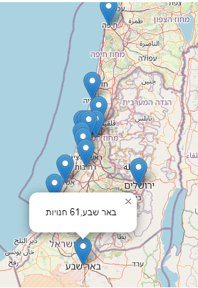
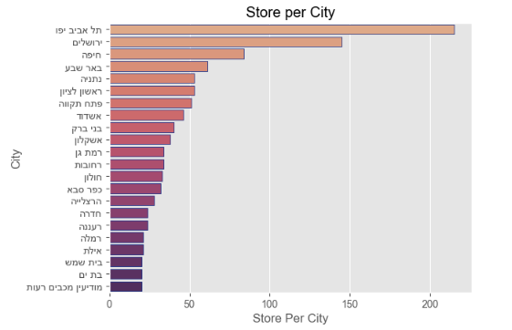

Israel Supermarket Data: Transform and visualize the data that published by the supermarkets.
=======================================
The data downloading used by [israeli-supermarket-scarpers](https://github.com/erlichsefi/israeli-supermarket-scarpers/) project

All data based on goverment project of price transparency,
שקיפות מחירים (השוואת מחירים) - https://www.gov.il/he/departments/legalInfo/cpfta_prices_regulations

Example
-----------
Example of map with that shows statistics of store per city

Store per city chart

Example of item data

	from price_parser import download_all_prices
	
	df = download_all_prices()
	df1.tail(20)

|          |provider     |       chainid |  subchainid |   storeid | itemcode | itemname |   itemprice |   unitqty |   unitofmeasureprice |   qtyinpackage | manufacturename   | manufacturecountry   | manufactureitemdescription           |   bisweighted |   allowdiscount | priceupdatedate     |   unitmeasure |   quantity |
| --------- | --------- | ------------- | ------------- |------------- | ------------- | ------------- | ------------- | ------------- | ------------- | ------------- | ------------- | ------------- | ------------- | ------------- | ------------- | ------------- | ------------- | ------------- |
| 7075218 | ZolVeBegadol | 7290058173198 |            1 |        89 | 8719200998049 | מזולה בטעם טבעי                      |        10.9 |     00000 |                0.109 |              0 | לא ידוע           | ישראל                | מזולה בטעם טבעי                      |             0 |               0 | 2021-10-27 10:43:45 |         00000 |          0 |
| 7075219 | ZolVeBegadol | 7290058173198 |            1 |        89 | 8720608014958 | תה ליפטון 1.5 גר' 100 יחידות         |        15.9 |     00000 |                0.159 |             12 | לא ידוע           | הודו                 | תה ליפטון 1.5 גר' 100 יחידות         |             0 |               0 | 2023-07-13 11:22:53 |         00000 |         12 |
| 7075220 | ZolVeBegadol | 7290058173198 |            1 |        89 | 8801055707966 | קפה בריסטה קלוי וטחון                |        36.9 |     00000 |                0.369 |             12 | לא ידוע           | לא ידוע              | קפה בריסטה קלוי וטחון                |             0 |               0 | 2023-05-28 09:59:11 |         00000 |         12 |
| 7075221 | ZolVeBegadol | 7290058173198 |            1 |        89 | 8801055709465 | נסקפה קפוצ'ינו וניל 10 יח' 185 גרם   |        21.5 |     00000 |                0.215 |              0 | לא ידוע           | דרום קוריאה          | נסקפה קפוצ'ינו וניל 10 יח' 185 גרם   |             0 |               0 | 2023-05-28 09:52:11 |         00000 |          0 |
| 7075222 | ZolVeBegadol | 7290058173198 |            1 |        89 | 8801055709489 | נסקפה קפוצ'ינו אגוזים 10 יח' 180 גרם |        21.5 |     00000 |                0.215 |              0 | לא ידוע           | דרום קוריאה          | נסקפה קפוצ'ינו אגוזים 10 יח' 180 גרם |             0 |               0 | 2023-05-28 09:52:12 |         00000 |          0 |
| 7075223 | ZolVeBegadol | 7290058173198 |            1 |        89 | 8850389105832 | סאפה תפוח ליטר                       |        12.7 |     00000 |               12.7   |              0 | לא ידוע           | תאילנד               | סאפה תפוח ליטר                       |             0 |               0 | 2023-05-25 16:54:56 |         00000 |          0 |
| 7075224 | ZolVeBegadol | 7290058173198 |            1 |        89 | 8850632604259 | יוגטה מקלות תות 24יח'                |         5   |     00000 |                0.05  |              0 | לא ידוע           | תאילנד               | יוגטה מקלות תות 24יח'                |             0 |               1 | 2019-11-29 01:59:50 |         00000 |          0 |
| 7075225 | ZolVeBegadol | 7290058173198 |            1 |        89 | 8850632604266 | יוגטה מקלות קולה 24יח'               |         5   |     00000 |                0.05  |              0 | לא ידוע           | תאילנד               | יוגטה מקלות קולה 24יח'               |             0 |               1 | 2019-11-30 04:02:36 |         00000 |          0 |
| 7075226 | ZolVeBegadol | 7290058173198 |            1 |        89 | 8850632604372 | יוגטה שטיח תות 24יח'                 |         5   |     00000 |                0.05  |              0 | לא ידוע           | תאילנד               | יוגטה שטיח תות 24יח'                 |             0 |               1 | 2019-11-29 10:54:17 |         00000 |          0 |
| 7075227 | ZolVeBegadol | 7290058173198 |            1 |        89 | 8850632604402 | יוגטה SOUR STICKS  - ממתק 50גר       |         5   |     00000 |                0.05  |              0 | לא ידוע           | לא ידוע              | יוגטה SOUR STICKS  - ממתק 50גר       |             0 |               1 | 2019-11-28 21:27:10 |         00000 |          0 |
| 7075228 | ZolVeBegadol | 7290058173198 |            1 |        89 | 8850632605201 | יוגטה חספוסים כתום 50 גרם            |         5   |     00000 |                0.05  |              0 | לא ידוע           | תאילנד               | יוגטה חספוסים כתום 50 גרם            |             0 |               1 | 2019-11-30 04:16:30 |         00000 |          0 |
| 7075229 | ZolVeBegadol | 7290058173198 |            1 |        89 | 8850632606390 | יוגטה שטיח אבטיח24יח'                |         4.5 |     00000 |                0.045 |              0 | לא ידוע           | תאילנד               | יוגטה שטיח אבטיח24יח'                |             0 |               1 | 2019-11-30 08:21:02 |         00000 |          0 |
| 7075230 | ZolVeBegadol | 7290058173198 |            1 |        89 | 8888111030053 | רביעיית מיץ אננס 100% 240 מ"ל        |        13.7 |     00000 |                0.137 |              0 | לא ידוע           | לא ידוע              | רביעיית מיץ אננס 100% 240 מ"ל        |             0 |               0 | 2022-05-19 15:44:24 |         00000 |          0 |
| 7075231 | ZolVeBegadol | 7290058173198 |            1 |        89 | 9002975393843 | 1X30X70G הריבו גולדברס               |         7.9 |     00000 |                0.079 |             30 | לא ידוע           | לא ידוע              | 1X30X70G הריבו גולדברס               |             0 |               1 | 2023-02-14 14:38:33 |         00000 |         30 |
| 7075232 | ZolVeBegadol | 7290058173198 |            1 |        89 | 9002975393850 | 1X30X70G הריבו וורמס                 |         7.9 |     00000 |                0.079 |             30 | לא ידוע           | לא ידוע              | 1X30X70G הריבו וורמס                 |             0 |               1 | 2023-02-14 14:38:34 |         00000 |         30 |
| 7075233 | ZolVeBegadol | 7290058173198 |            1 |        89 | 9310072028743 | 'טיםטם אורגינל 200גר                 |        20.9 |     00000 |                0.209 |             24 | לא ידוע           | לא ידוע              | 'טיםטם אורגינל 200גר                 |             0 |               0 | 2016-11-21 14:04:18 |         00000 |         24 |
| 7075234 | ZolVeBegadol | 7290058173198 |            1 |        89 | 9310072028750 | 'טיםטם דאבל 200גר                    |        20.9 |     00000 |                0.209 |             24 | לא ידוע           | לא ידוע              | 'טיםטם דאבל 200גר                    |             0 |               0 | 2016-11-21 14:03:30 |         00000 |         24 |
| 7075235 | ZolVeBegadol | 7290058173198 |            1 |        89 | 9771565025005 | מעריב סוף שבוע                       |         5.9 |     00000 |                5.9   |              0 | לא ידוע           | לא ידוע              | מעריב סוף שבוע                       |             0 |               0 | 2022-02-02 17:19:35 |         00000 |          0 |
| 7075236 | ZolVeBegadol | 7290058173198 |            1 |        89 | 9771565051011 | ידיעות שישי+ חג                      |        14.9 |     00000 |               14.9   |              0 | לא ידוע           | לא ידוע              | ידיעות שישי+ חג                      |             0 |               0 | 2021-11-23 11:08:17 |         00000 |          0 |
| 7075237 | ZolVeBegadol | 7290058173198 |            1 |        89 | 9771565051066 | ידיעות שישי+ חג                      |        14.9 |     00000 |               14.9   |              0 | לא ידוע           | לא ידוע              | ידיעות שישי+ חג                      |             0 |               0 | 2021-11-23 11:08:27 |         00000 |          0 |

Quick start
-----------

This set of command, installed the project on your computer, and run it on [jupyter](https://jupyter.org/)

	git clone https://github.com/AKorets/israeli-supermarket-data
	cd israeli-supermarket-data
	python -m venv venv
	venv\Scripts\activate.bat
	pip install -r requirements.txt
	jupyter notebook city_visual.ipynb

