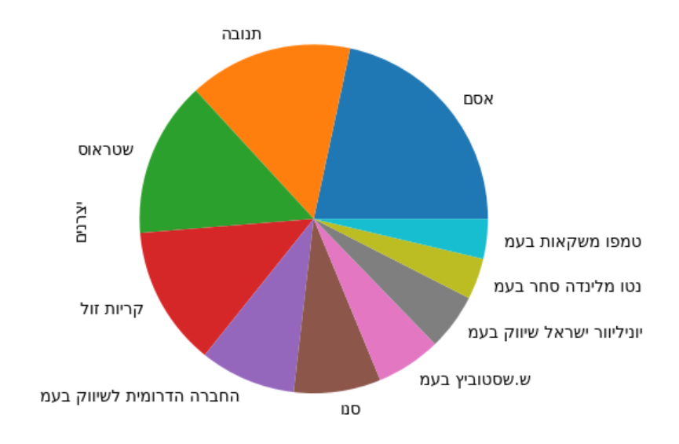

Israel Supermarket Data: Transform and visualize the data that published by the supermarkets.
=======================================
The data downloading used by [erlichsefi/israeli-supermarket-scarpers](https://github.com/erlichsefi/israeli-supermarket-scarpers/) project

All data is based on the government's project for price transparency.
    שקיפות מחירים (השוואת מחירים) - https://www.gov.il/he/departments/legalInfo/cpfta_prices_regulations  
The current state of the original data is a mess that contains a bunch of XML with different schemas and encodings.   
The main goal of this project is to make the data accessible and in one format ([pandas](https://pandas.pydata.org/docs/index.html) csv)

  
Example
-----------
An example of a map that shows statistics on stores per city [city_visual.ipynb](city_visual.ipynb)

Store per city chart [city_visual.ipynb](city_visual.ipynb)

Top Manufacturers chart

You can find examples of how to get and display data in pandas format in [Items.md](Items.md)

Quick start
-----------

This set of commands puts the project on your computer and runs it on [Jupyter](https://jupyter.org/).

	git clone https://github.com/AKorets/israeli-supermarket-data
	cd israeli-supermarket-data
	python -m venv venv
	venv\Scripts\activate.bat
	pip install -r requirements.txt
	jupyter notebook city_visual.ipynb

