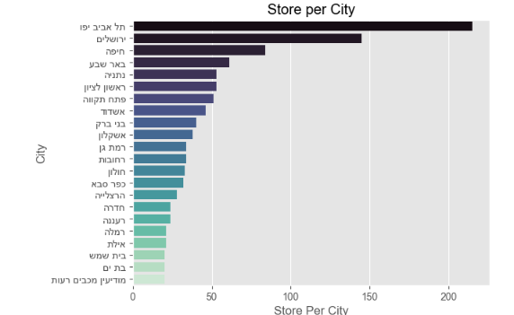

Israel Supermarket Data: Transform and visualize the data that published by the supermarkets.
=======================================
The data downloading used by [israeli-supermarket-scarpers](https://github.com/erlichsefi/israeli-supermarket-scarpers/) project

All data based on goverment project of price transparency,
שקיפות מחירים (השוואת מחירים) - https://www.gov.il/he/departments/legalInfo/cpfta_prices_regulations

Example
-----------
Example of map with that shows statistics of store per city

Store per city chart

Example of item data

	from price_parser import download_all_prices
	
	df = download_all_prices()
	df1.tail(6)

|          |provider     |       chainid |  subchainid |   storeid | itemcode | itemname |   itemprice |   unitqty |   unitofmeasureprice |   qtyinpackage | manufacturename   | manufacturecountry   | manufactureitemdescription           |   bisweighted |   allowdiscount | priceupdatedate     |   unitmeasure |   quantity |
| --------- | --------- | ------------- | ------------- |------------- | ------------- | ------------- | ------------- | ------------- | ------------- | ------------- | ------------- | ------------- | ------------- | ------------- | ------------- | ------------- | ------------- | ------------- |
| 7075218 | ZolVeBegadol | 7290058173198 |            1 |        89 | 8719200998049 | מזולה בטעם טבעי                      |        10.9 |     00000 |                0.109 |              0 | לא ידוע           | ישראל                | מזולה בטעם טבעי                      |             0 |               0 | 2021-10-27 10:43:45 |         00000 |          0 |
| 7075219 | ZolVeBegadol | 7290058173198 |            1 |        89 | 8720608014958 | תה ליפטון 1.5 גר' 100 יחידות         |        15.9 |     00000 |                0.159 |             12 | לא ידוע           | הודו                 | תה ליפטון 1.5 גר' 100 יחידות         |             0 |               0 | 2023-07-13 11:22:53 |         00000 |         12 |
| 7075220 | ZolVeBegadol | 7290058173198 |            1 |        89 | 8801055707966 | קפה בריסטה קלוי וטחון                |        36.9 |     00000 |                0.369 |             12 | לא ידוע           | לא ידוע              | קפה בריסטה קלוי וטחון                |             0 |               0 | 2023-05-28 09:59:11 |         00000 |         12 |
| 7075221 | ZolVeBegadol | 7290058173198 |            1 |        89 | 8801055709465 | נסקפה קפוצ'ינו וניל 10 יח' 185 גרם   |        21.5 |     00000 |                0.215 |              0 | לא ידוע           | דרום קוריאה          | נסקפה קפוצ'ינו וניל 10 יח' 185 גרם   |             0 |               0 | 2023-05-28 09:52:11 |         00000 |          0 |
| 7075222 | ZolVeBegadol | 7290058173198 |            1 |        89 | 8801055709489 | נסקפה קפוצ'ינו אגוזים 10 יח' 180 גרם |        21.5 |     00000 |                0.215 |              0 | לא ידוע           | דרום קוריאה          | נסקפה קפוצ'ינו אגוזים 10 יח' 180 גרם |             0 |               0 | 2023-05-28 09:52:12 |         00000 |          0 |
| 7075223 | ZolVeBegadol | 7290058173198 |            1 |        89 | 8850389105832 | סאפה תפוח ליטר                       |        12.7 |     00000 |               12.7   |              0 | לא ידוע           | תאילנד               | סאפה תפוח ליטר                       |             0 |               0 | 2023-05-25 16:54:56 |         00000 |          0 |

Quick start
-----------

This set of command, installed the project on your computer, and run it on [jupyter](https://jupyter.org/)

	git clone https://github.com/AKorets/israeli-supermarket-data
	cd israeli-supermarket-data
	python -m venv venv
	venv\Scripts\activate.bat
	pip install -r requirements.txt
	jupyter notebook city_visual.ipynb

